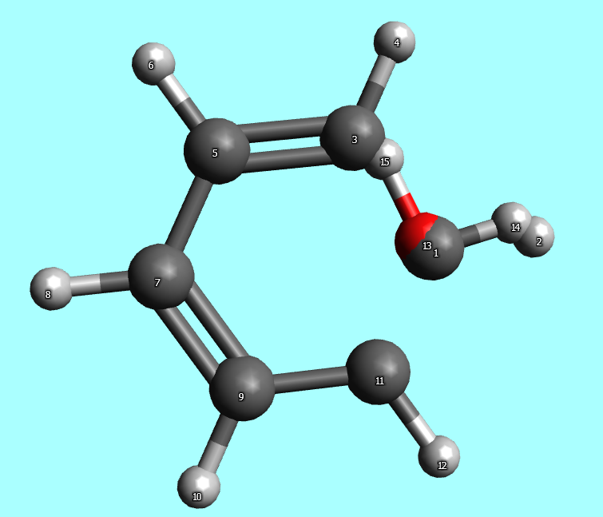
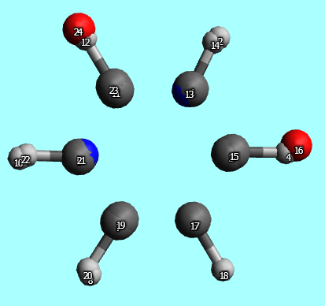

## lalignment.py

* Source:

  [click here](https://github.com/leucinw/ComputTools/tree/master/src/lalignment.py)

* Usage:

  ```shell
  python lalignment.py -frag1 FRAGMENT1 -frag2 FRAGMENT2 -indx1 ATOMINDICES1 [ATOMINDICES1 ...] -indx2 ATOMINDICES2 [ATOMINDICES2 ...] -dimer DIMERNAME
  ```

* Intro:

  This program is used to align the second structure to the first one based on the atoms given in `indx1` and `indx2`. 

* Examples:
	
	* Align water.xyz to Benzene.xyz. (three atoms selected)
		
	* Align Benzene.xyz to Uracil.xyz (three atoms selected)
		
	* Align a DNA fragment to another based on the base and sugar atoms
	* Align proteins to get calculate RMSD 